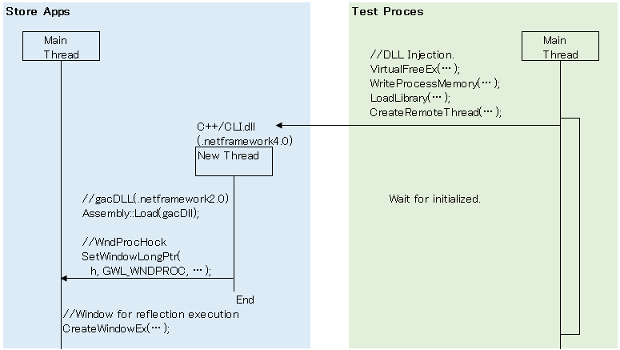
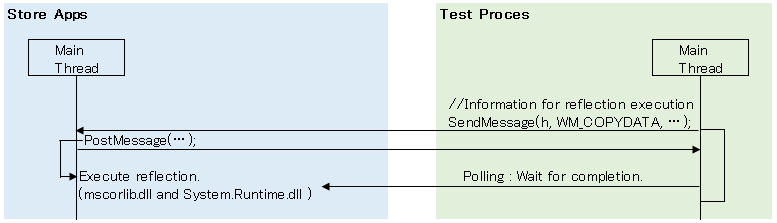

Friendly.Store_α
==============

Demo(Please watch at full screen.)

https://www.youtube.com/watch?v=vV7o8xh8xoc

==============

You have to install Codeer.Friendly.Stroe.Core.

Download it.
http://goo.gl/deV0J4

NuGet
https://www.nuget.org/packages/Codeer.Friendly.Store/

==============

This library is a layer on top of Friendly, so you must learn that first. But it is very easy to learn.

http://www.english.codeer.co.jp/test-automation
(No need Installer. NuGet Only.)

==============
Sample.
```cs   
//attach.
var app = new StoreAppFriend(Process.GetProcessesByName("App1")[0]);

//add button.
dynamic current = app.Type().Windows.UI.Xaml.Window.Current;
dynamic main = current.Content.Content;
dynamic button = app.Type().Windows.UI.Xaml.Controls.Button();
button.Content = "NewButton";
main._grid.Children.Add(button);
```

==============
Abstract [new StoreAppFriend(process);]


Abstract [button.Content = "NewButton";]


