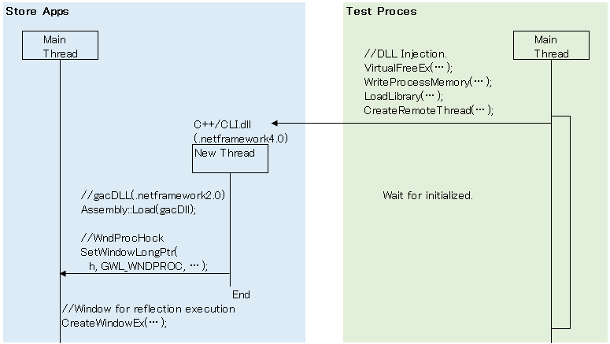
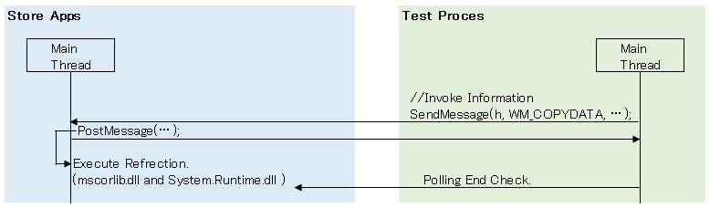

Friendly.Store_α
==============

You have to install Codeer.Friendly.Stroe.Core.

Download it.
http://goo.gl/deV0J4

You must learn Friendly first.  

http://www.english.codeer.co.jp/test-automation/friendly-fundamental  

Demo

https://www.youtube.com/watch?v=vV7o8xh8xoc

==============
Sample.
```cs   
//attach.
var app = new StoreAppFriend(Process.GetProcessesByName("App1")[0]);

//add button.
dynamic current = app.Type().Windows.UI.Xaml.Window.Current;
dynamic main = current.Content.Content;
dynamic button = app.Type().Windows.UI.Xaml.Controls.Button();
button.Content = "NewButton";
main._grid.Children.Add(button);
```

==============
Abstract new StoreAppFriend(process);


Abstract button.Content = "NewButton";


